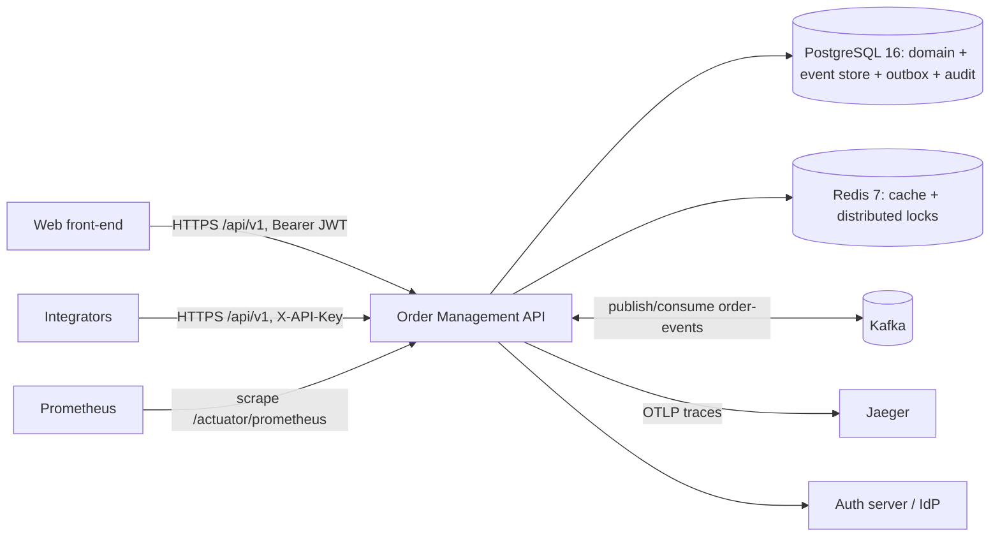
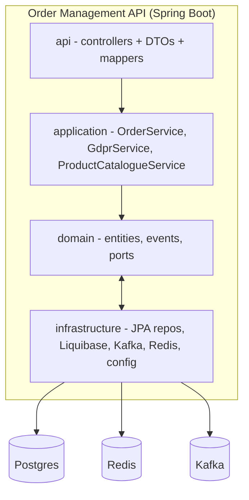

# 03 — Architecture & Onboarding Pack

## Part A — Renderable C4 diagrams

The design doc (`docs/design`) uses ASCII. Add real diagram sources that render
on GitHub and in tooling:

### Context diagram (Mermaid)

### Container diagram (Mermaid)

Save these as `docs/diagrams/*.mmd` (and/or `.puml`) so they render and can be
edited. Adding them later to the design README makes the whole doc set
shareable in a slide.

## Part B — As-built ADR register

Store ADRs as numbered files (`docs/adr/0001-layering.md`, ...). Use the
format: **Status · Context · Decision · Consequences · (Supersedes)**. Register:

| # | Title | Status | Where decided |
|---|---|---|---|
| 0001 | Layering & dependency rules | Accepted (drift noted) | PR #1, #20/#21 |
| 0002 | RFC 7807 error contract, last-resort handler | Accepted | PR #24 |
| 0003 | OAuth2 resource server + scope matrix | Accepted (guards incomplete) | PR #26 |
| 0004 | Idempotency keys (order create first) | Accepted / partial | PR #24 |
| 0005 | State transitions as maps | Accepted / deferred | PR #22 (plan #13) |
| 0006 | Cache DTOs; evict per writer; TTL | Accepted | PR #28 |
| 0007 | Outbox publishing; manual ack; DLT | Accepted | PR #31 |
| 0008 | GDPR erasure vs anonymization; no-PII audit | Accepted | PR #27 |
| 0009 | JWT RS256/JWKS for prod (HS256 dev) | Accepted / deferred | PR #26 |
| 0010 | Rate limiting per API key (in-memory v1) | Accepted / superseded by Redis plan | PR #29 |

Each ADR file gets the same care as a class comment: context (why), decision,
consequences (what you gave up). That is the artifact reviewers expect to see
in a serious project.

## Part C — Repo navigation map (20-minute tour)

1. **Start**: `README.md` status → `docs/design/README.md` (how it fits) →
   `src/main/resources/application.yml` (every knob, commented).
2. **Order flow**: `api/rest/controller/OrderController.java` → `OrderRequest`
   → `OrderService.placeOrder` → follow stock lock, payment gateway, outbox.
3. **Schema**: `db/changelog/v1.0/*`; match entities in `domain/`.
4. **Cross-cutting:** security → `security/`; PII → `security/pii/`; cache →
   `ProductCatalogueService`; resilience → `SimulatedPaymentGateway` +
   `resilience4j.*` in application.yml; events → `messaging/*` + `domain/outbox`;
   observability → `observability/` + `config/ObservabilityConfig`.
5. **Tests**: one class per concept under `src/test/java/...` - search the name
   of the concept (`NPlusOneDemoTest`, `ResilienceChaosIntegrationTest`, ...).
6. **Ops**: `Dockerfile`, `docker-compose.yml`, `k8s/base` + `overlays`,
   `.github/workflows`.
Keep this map in `docs/` and point new engineers (or your interviewers) at it:
it demonstrates you can lead someone into a large codebase quickly.
